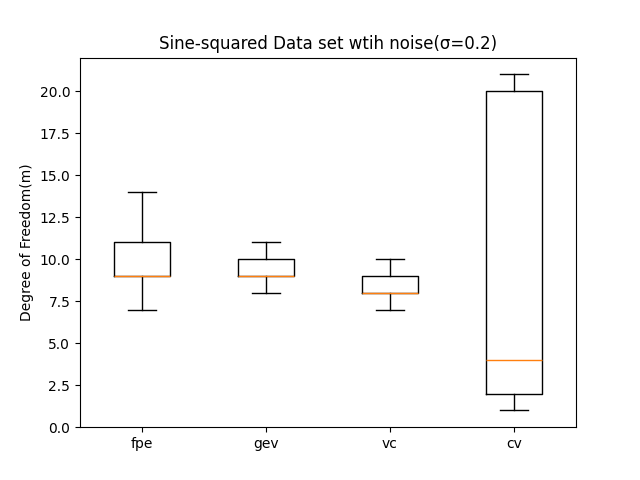
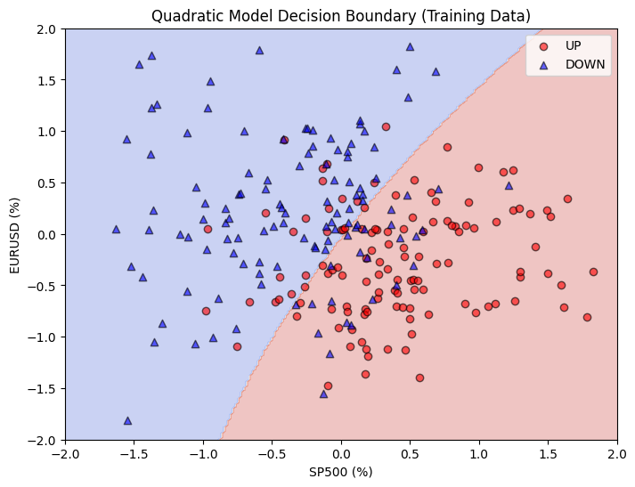

# Report: Trading Strategy Using Machine Learning Models
> 張祐嘉 41047055s
## Problem 1

### Data set
- Following the same regression data set from Section 4.4
  - pure noise: Gaussian noise with a σ = 1, x-values are uniformly distributed in [0,1]
  - sine-squared: σ = 0.2 for additive noise
  - Generated 300 realizations each with sample size 100 

- Pure noise
.png)
 

  - The optimal DoF is 1, with vc providing the lowest prediction risk and variability by consistently selecting the lower complexity models.
  - Cv selects the most complex models and generates a overall higher risk

- Sine-squared
.png)
 

  - Using cross-validation seems to generate a large variation on the risk, but has a overall low risk compare to other methods. The other models have a similar distributon of risk. Regarding of the model complexity, the vc yields a lower DoF, while cv varies a lot on selecting the model. 

## Problem 2
### 1. Introduction

This report explores the effectiveness of using two machine learning models (linear and quadratic classifiers) to predict investment strategies for FIGRX using SP500 and EURUSD daily percentage changes as inputs. The performance of these models is compared to a simple Buy-and-Hold (B-H) strategy.

### 2. Data Preparation

Data Sources
- The data was downloaded from Yahoo and UBC websites.
- Input features and the output are encoded as daily percentage changes.

Data Encoding
- SP500 Percentage Change: 
- EURUSD Percentage Change: 
- FIGRX Percentage Change: 
- 

##3 3. Model Training and Decision Boundaries

#### Linear Model
- Linear classifier estimated via linear least-squares regression
  
Training data(2004)   |  Testing data(2005)
:-------------------------:|:-------------------------:
  |  

#### Quadratic Model
-  Quadratic decision boundary classifier

Training data(2004)   |  Testing data(2005)
:-------------------------:|:-------------------------:
  |  

**Discussion**
- Both the model were able to separate the data points successfully since the data distribution isn't too random, and the boundary that quadratic model drew is actually quite close to the linear one. The quadratic model’s boundary captures more subtle patterns but may be prone to overfitting.

### 4. Model Performance Evaluation
**Performance Metrics**
- GAIN: Cumulative gain or loss in percentage at the end of the year.

- EXPOSURE: The proportion of days when the account is fully invested in FIGRX.

| Model               | GAIN (%) | EXPOSURE (%) |
|---------------------|----------|--------------|
| Linear Classifier   | 57.00    | 48.36       |
| Quadratic Classifier| 56.41    | 47.54       |
| Buy-and-Hold (B-H)  | 14.92    | 100.00      |

- The following graph display the results of cumulative gain/loss of the two trading strategies

- Training data(2004)
 

- Testing data(2005)

**Discussion of Performance**
- The trading strategy shows that on the training data, the model presents identical results, we could tell the result from the previous boundary plots since the different models yielded similar boundaries. The testing result yield still a similar result but with linear one performing slightly better.

### 5. Discussion and Interpretation

(a) Practical Use of the Trading Strategy
 
The trading strategies outperform the Buy-and-Hold strategy, with reduced exposure indicating lower market risk. However, given the limitations of historical data and model assumptions, these strategies might not be reliable for future markets. Both the model has a low 50% exposure, as the trading account is out of market ha;f the time.

> Would you bet your own money? No, more recent data and regulation-adjusted performance evaluations are needed before practical application.
 

(b) Theoretical Explanation Using VC Theory

The Vapnik-Chervonenkis (VC) theory provides insights into the complexity of models relative to their generalization ability:

- VC-Dimension: The linear model, with a lower VC-dimension, has fewer parameters and is less likely to overfit, making it more generalizable. The quadratic model, with a higher VC-dimension, fits the training data well but risks overfitting.
- Model Complexity: According to VC-theory, models with lower complexity (fewer parameters) have a higher chance of performing well on unseen data. Our use of fixed low-complexity models, such as linear and quadratic classifiers, balances the trade-off between bias and variance.
- Why No Complexity Control?: The models in this study did not use adaptive complexity control mechanisms like regularization, as the goal was to illustrate decision boundary behavior and evaluate the practical feasibility of trading strategies under simple assumptions.

