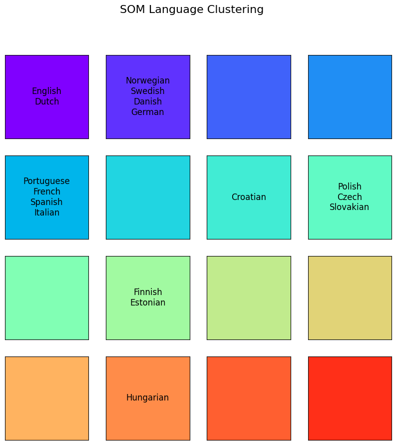
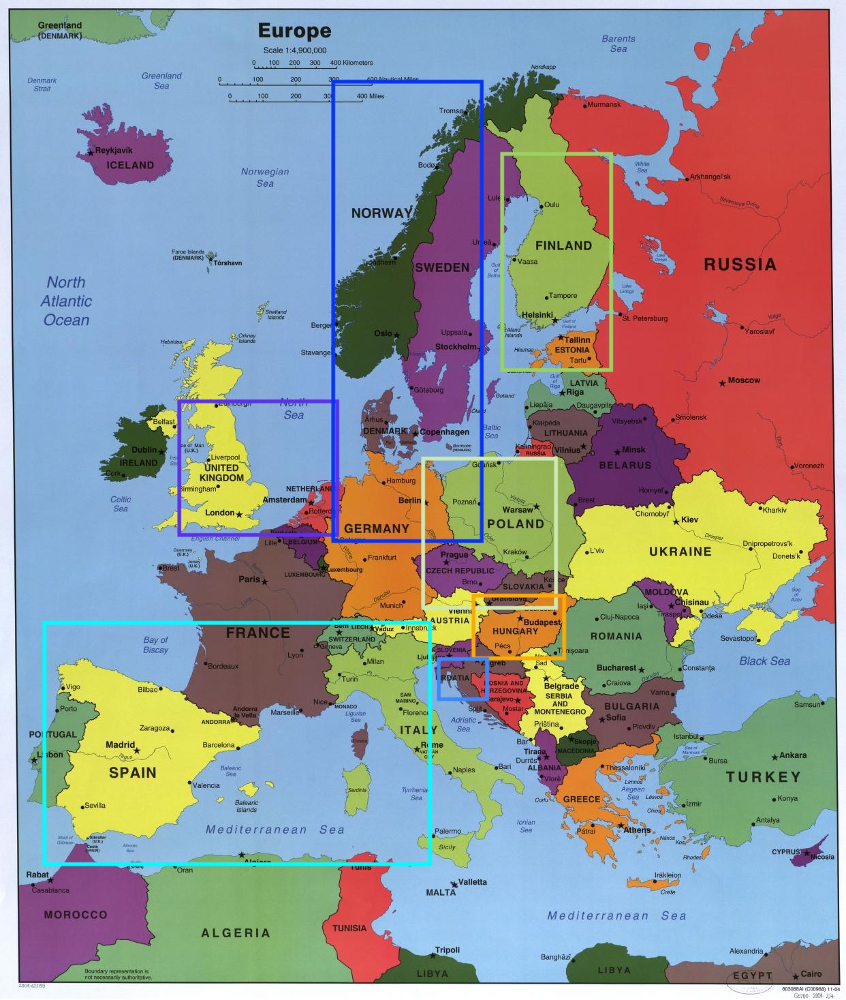
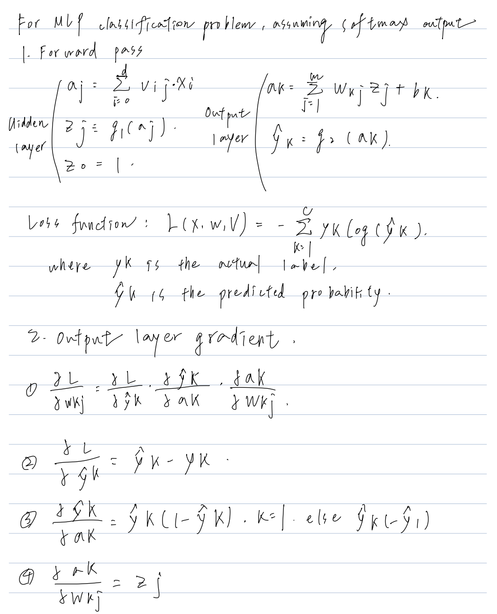
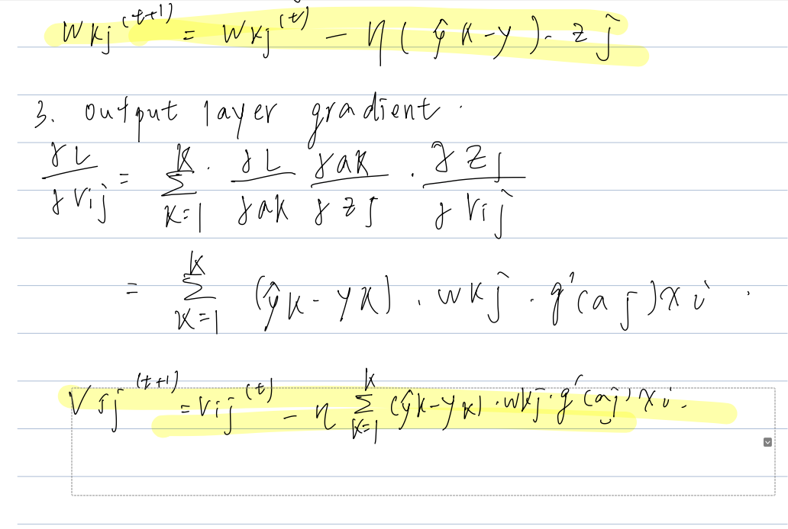
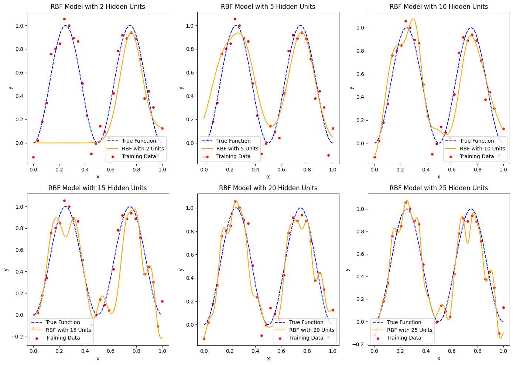
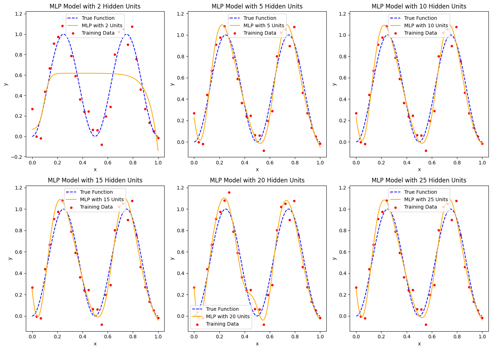

## Homework 3 
> 41047055s 張祐嘉
### Problem 1: SOM Clustering Analysis
#### Result: 

  
  

- The SOM effectively clusters languages based on linguistic roots and geographic proximity.
Results align well with known language families, though some nodes remain unused.

#### Node Analysis
- Node (0, 0): English, Dutch
  - Both are West Germanic languages.
  - Evaluation: Accurate grouping based on linguistic roots.

- Node (0, 1): Norwegian, Swedish, Danish, German
  - North Germanic: Norwegian, Swedish, Danish.
  - West Germanic: German.
  - Evaluation: Strong clustering, although German could also group with English/Dutch.

- Node (1, 0): Portuguese, French, Spanish, Italian
  - Romance languages with shared Latin origin.
  - Evaluation: Excellent clustering reflecting linguistic similarities.
-Node (1, 2): Croatian

  - South Slavic language, slightly isolated from other Slavic languages.
  - Evaluation: Reasonable, though it might group better with Slavic languages in Node (1, 3).
- Node (1, 3): Polish, Czech, Slovakian

  - West Slavic languages with shared features and proximity.
  - Evaluation: Strong grouping.
- Node (2, 1): Finnish, Estonian

  - Uralic languages, distinct from Indo-European languages.
  - Evaluation: Excellent clustering reflecting their unique linguistic family.
- Node (3, 1): Hungarian

  - Isolated as a Uralic language, distinct from others.
  - Evaluation: Accurate and expected.

Weaknesses
- Germanic Split: German in Node (0, 1) could group with English/Dutch in Node (0, 0).
- Croatian Isolation: Positioned in Node (1, 2), separated from Slavic cluster in Node (1, 3).

### Problem 2: MLP back propagation

### Problem 3: RBF and MLP networks

- RBF: 

The model with 2 hidden units underfits the data, the model with 5 units yields the best estimate, 10 shows a slight overfitting curve and the model with over 15 units show significant overfitting.

- MLP: 

The model with 2 hidden units underfits the data. MLP models with 5 and 10 units closely approximate the target function; and the model with 20 units shows slight overfitting for input values near 0.4, but overall there is almost no overfiting, even when the number of hidden units is quite large.

- Comparison
  - **MLP:**
    - Learns a global mapping between input and output.
    - Each neuron contributes to the overall function over the entire input space.
  - **RBF:**
    - Learns a local mapping by activating neurons based on proximity to centers.
    - Each RBF neuron contributes only to a local region defined by the radial basis kernel.
- Conclusion
  - **MLP Generalization:** The ability to learn a global function, combined with effective regularization techniques, ensures that MLP generalizes better as the hidden unit size increases.
  - **RBF Generalization:** The local nature of RBF leads to overfitting and poor scalability with a large number of hidden units, especially in noisy data or high-dimensional spaces.
