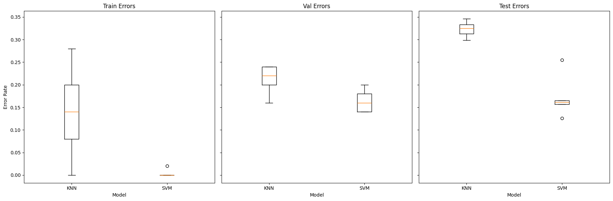
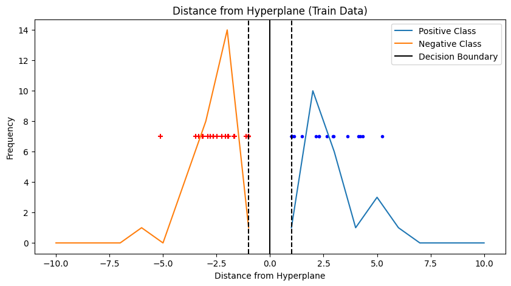
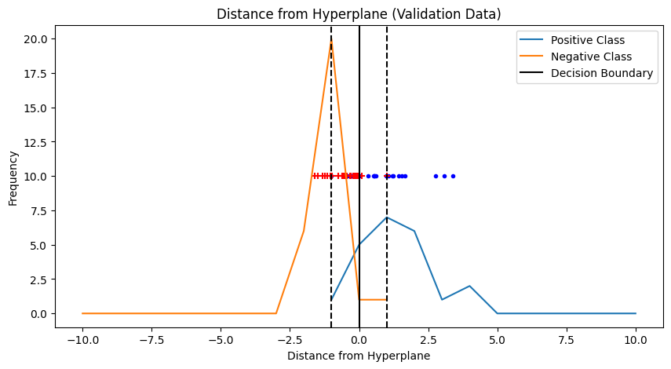
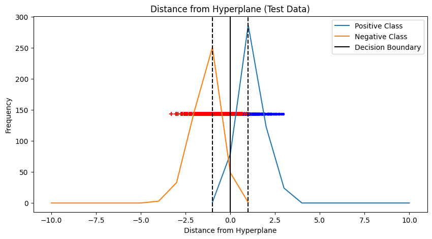
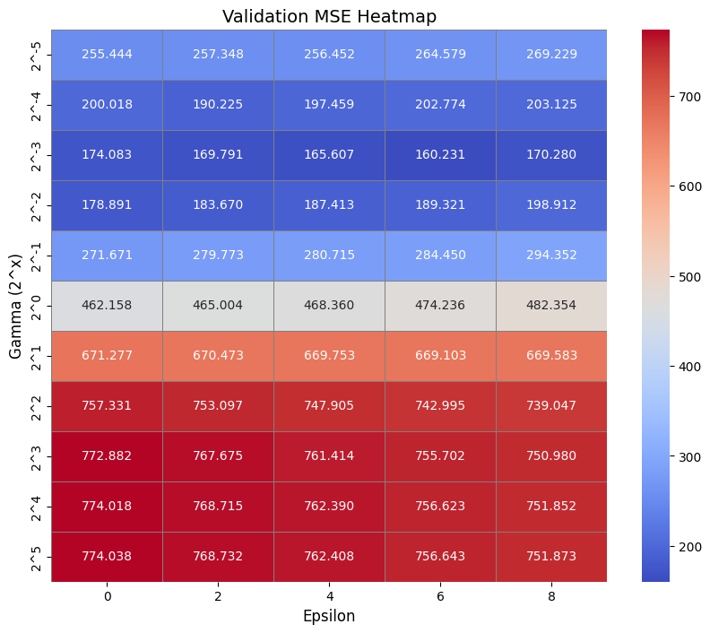
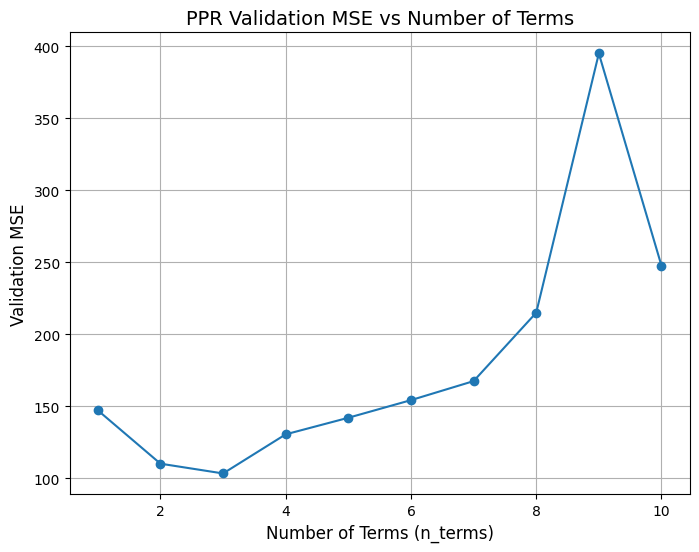

# HW4
> 張祐嘉 41047055s

## Problem 1
**(a)**
- Hyperparameters 
  - Trained kNN with k from 1 - 21 and selected the best k value
  - SVM with c value from 0.1, 1, 10, 100
- Comparison of train, validation, test error :
  - Average result of 5 realizations, it is obvious that SVM outperforms the kNN model
  

**(b)**
## Analytical bound overview
$$
E_n[\text{error rate}] \leq \frac{E_n[\text{number of support vectors}]}{n}.
$$

- This bound suggests that the **error rate** is proportional to the ratio of the number of **support vectors** to the size of the dataset (\(n\)).
- A **smaller fraction** indicates better generalization, as fewer support vectors typically correspond to **simpler models** with larger margins.

$$
h \leq \min\left(\frac{r^2}{\Delta^2}, d\right) + 1,
$$

- \(h\) is the **VC dimension** 
- \(r\) is the radius of the smallest sphere containing the training data
- \(Δ) is the margin
- \(d\) is the dimensionality of the input space, which is 20 here
--- 

## Histogram of projection

## Selection of the Analytical Bound

### Data Summary:
- **SVM Best \(C\)**: 100
- **Errors**:
  - Train: \(0.0\)
  - Validation: \(0.16\)
  - Test: \(0.13\)
- **Error Bound**:
  - Train: \(0.38\)
  - Validation: \(0.38\)
  - Test: \(0.019\)
- **VC Bound**:
  - Train: \(10.73\)
  - Validation: \(5.02\)
  - Test: \(5.01\)

### Histogram Observations:
- **Train Data**:
  - Many points close to the decision boundary.
  - High reliance on support vectors.
  - Indicates high model complexity.
- **Validation Data**:
  - Fewer points near the margin compared to training data.
  - Larger margin suggests reduced complexity compared to training data.
- **Test Data**:
  - Most points far from the decision boundary, indicating a large margin.
  - Very few support vectors required, reflecting strong generalization.

### Bound Selection:
- **VC Bound**:
  - Captures theoretical model complexity based on margin size and data geometry.
  - Validation (\(5.02\)) and Test (\(5.01\)) VC bounds align with a simpler, generalizable model.
  - Train VC bound (\(10.73\)) reflects overfitting or noise in the training set.
- **Error Bound**:
  - Reflects the ratio of support vectors to dataset size.
  - Test error bound (\(0.019\)) is very low, indicating minimal reliance on support vectors for generalization.
  - Validation and Train error bounds (\(0.38\)) are higher, suggesting greater complexity.

### Conclusion:
- **VC Bound is the better choice**:
  - It provides insights into the underlying complexity of the model and its margin-based generalization.
  - Consistent lower bounds for validation (\(5.02\)) and test (\(5.01\)) indicate effective generalization.
- The **Error Bound** is practical for understanding reliance on support vectors but less informative about margin complexity.

## Problem 2
**(a)**
- Analytic Prescription for C: **97.5488**
$$
\max \left( \left| \bar{y} + 3\sigma_y \right|, \left| \bar{y} - 3\sigma_y \right| \right)
$$

- Best epsilon: 2, Best gamma: $2^{-4}$

- Test error:
  - **MSE: 107.1597**
  - **Test NRMSE: 0.0705**

**(b)**
## PPR
- Selecting the complexity parameter 

- When there are 3 terms, we obtain the lowest MSE

## Comparison 
- SVM Test MSE: 147.6057, NRMSE: 0.0947
- PPR Test MSE: 84.9882, NRMSE: 0.0718
- The results demonstrate that PPR outperforms SVM on this dataset due to its ability to handle non-linear interactions and flexibly fit the data’s structure. 
